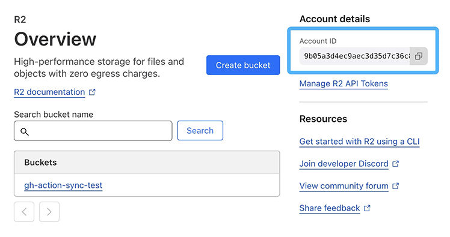

# Build Index for CloudFlare R2

The `build-index-action` is a GitHub Action designed to generate `index.html` for each directory on CloudFlare R2.

## Environment Variables

The `build-index-action` takes the following environment variables as inputs:

| Name               | Default | Required | Description                |
|--------------------|---------|----------|----------------------------|
| SYNC_BUCKET        |         | Yes      | Storage bucket name.       |
| SYNC_REGION        |         | Yes      | Region name or identifier. |
| SYNC_ACCESS_ID     |         | Yes      | API access ID.             |
| SYNC_ACCESS_SECRET |         | Yes      | API aceess secret.         |

## Notes

- `SYNC_ACCESS_ID` and `SYNC_ACCESS_SECRET` are confidential and should NOT be written in GitHub action yaml. Add these values as [encrypted secrets](https://docs.github.com/en/actions/security-for-github-actions/security-guides/using-secrets-in-github-actions) and pass the secrets as env inputs.

## Configurations

### CloudFlare

The region of CloudFlare R2 must be set to your account id which can be found on R2 page:

## How to Serve Static Web Site on CloudFlare R2

1. Setup domain for R2, for example, `www.example.com`; [[Guide](https://developers.cloudflare.com/r2/buckets/public-buckets/#custom-domains)]
2. Upload files to R2 bucket;
3. Setup rules: [[Guide](https://developers.cloudflare.com/rules/)]

| Order | Name                   | Match against                                   | Action                                                                                                                             |
|-------|------------------------|-------------------------------------------------|------------------------------------------------------------------------------------------------------------------------------------|
| 1     | Redirect http to https | URI Full wildcard r"http://*"                   | 301 redirect to wildcard_replace(http.request.full_uri, r"http://*", r"https://${1}")                                              |
| 2     | Redirect /             | URI Full wildcard r"https://www.example.com/"   | 301 redirect to wildcard_replace(http.request.full_uri, r"https://www.example.com/", r"https://www.example.com/index.html")        |
| 3     | Redirect */            | URI Full wildcard r"https://www.example.com/*/" | 301 redirect to wildcard_replace(http.request.full_uri, r"https://www.example.com/*/", r"https://www.example.com/${1}/index.html") |
